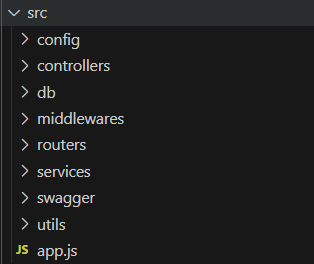

# wanted-pre-onboarding-backend

## 구현 과정

이전의 프로젝트를 진행할 때 디렉토리 구조는 controllers, services, models, shemas 등으로 파일을 관리했습니다.
그러나 이 구조의 단점은 유지, 보수할 때 user에 관한 것을 수정하려면 모든 폴더를 열어서 파일을 찾아가며 코드를 변경하는 불편함을 겪었습니다.
그래서 user 폴더 내에 user와 관련된 controller, service, model 파일을 생성하여 유지, 보수에 편리하도록 구성했습니다.

**Before:**



**After:**

```
📦src
┣ 📂application
┃ ┣ 📂entities
┃ ┃ ┗ 📜applicationEntity.js
┃ ┗ 📜applicationModel.js
┣ 📂company
┃ ┗ 📂entities
┃ ┃ ┗ 📜companyEntity.js
┣ 📂config
┃ ┗ 📜config.js
┣ 📂middlewares
┃ ┗ 📜errorMiddleware.js
┣ 📂post
┃ ┣ 📂entities
┃ ┃ ┗ 📜postEntity.js
┃ ┣ 📂routers
┃ ┃ ┗ 📜postRouter.js
┃ ┣ 📂test
┃ ┃ ┗ 📜postService.test.js
┃ ┣ 📂utils
┃ ┃ ┗ 📜postFunctions.js
┃ ┣ 📂validations
┃ ┃ ┗ 📜validations.js
┃ ┣ 📜postController.js
┃ ┣ 📜postModel.js
┃ ┗ 📜postService.js
┣ 📂user
┃ ┗ 📂entities
┃ ┃ ┗ 📜userEntity.js
┣ 📂utils
┃ ┣ 📜commonFunctions.js
┃ ┣ 📜logger.js
┃ ┣ 📜morgan.js
┃ ┗ 📜statusCode.js
┣ 📜app.js
┗ 📜dbIndex.js
```

## ERD 작성


sequelize의 paranoid: true로 하여 soft delete를 구현했습니다.
그래서 ERD에도 created_at과 deleted_at을 추가했습니다.
채용 마감일은 상시 채용 형태가 있기 때문에 NULL을 허용했습니다.

## API 문서

[원티드 채용공고 API](https://knotty-save-78e.notion.site/API-e2c144840ee5435cbd6017279ef973f3?pvs=4)

## 요구 사항

### 1. 채용공고를 등록합니다.

```javascript
// postService.js
createPost: async ({ newPostData }) => {
    try {
      const post = await PostModel.create({ newPostData });

      return { message: '게시글 생성에 성공했습니다.', post };
    } catch (error) {
      if (error instanceof UnauthorizedError) {
        throw error;
      } else {
        throw new InternalServerError('게시물 작성을 실패했습니다.');
      }
    }
  },
```

- 채용공고 등록은 POST 메서드를 사용했습니다.
- 클라이언트에서 newPostData를 객체 형태로 전달 받습니다.
- sequelize의 create 메서드를 사용해서 postModel.js에서 데이터베이스에 데이터가 생성되면 postController.js에서 statusCode 201을 응답합니다.

### 2. 채용공고를 수정합니다.

```javascript
// postService.js
  updatePost: async ({ userId, postId, toUpdate }) => {
    try {
      const post = await PostModel.getPostById(postId);
      throwNotFoundError(post, '게시글');
      checkAccess(post.userId, userId, '수정');

      const updatedPost = await post.update(toUpdate);

      return { message: '게시글 수정을 성공했습니다.', updatedPost };
    } catch (error) {
      if (error instanceof UnauthorizedError || error instanceof NotFoundError) {
        throw error;
      } else {
        throw new InternalServerError('게시글 수정을 실패했습니다.');
      }
    }
  },
```

- 채용공고 수정은 PUT 메서드를 사용했습니다.
- 데이터베이스에서 클라이언트에서 수정하고자 하는 postId를 가진 채용공고가 있는지 확인하고 없으면 NotFoundError을 있으면 업데이트를 할 수 있습니다.
- 모델에서 sequelize update 메서드로 postId와 일치하는 채용공고를 수정합니다.
- 업데이트 후, statusCode 200을 응답합니다.

### 3. 채용공고를 삭제합니다.

```javascript
// postService.js
  deletePost: async ({ userId, postId }) => {
    try {
      const post = await PostModel.getPostById(postId);
      throwNotFoundError(post, '게시글');
      checkAccess(post.userId, userId, '삭제');

      await PostModel.delete(postId);

      return { message: '게시글 삭제를 성공했습니다.' };
    } catch (error) {
      if (error instanceof UnauthorizedError || error instanceof NotFoundError) {
        throw error;
      } else {
        throw new InternalServerError('게시글 삭제를 실패했습니다.');
      }
    }
  },
```

- 채용공고 삭제는 DELETE 메서드를 사용했습니다.
- 클라이언트에서 postId와 userId를 보내면 데이터베이스에 postId와 일치하는 채용공고가 있는지 확인합니다.
- throwNotFoundError 함수가 실행하여 채용공고가 없으면 NotFoundError를 보냅니다.
- checkAccess 함수가 실행하여 userId와 일치하지 않으면 UnauthorizedError를 보냅니다.
- 두 경우 모두 통과하면 postId와 일치하는 채용공고를 삭제합니다.
- 삭제에 성공하면 statusCode 200을 응답합니다.

### 4-1. 채용공고 목록을 가져옵니다.

```javascript
// postService.js
  getAllPosts: async (search) => {
    try {
      const posts = await PostModel.getAllPosts(search);

      return { message: '게시글 전체 조회를 성공했습니다.', posts };
    } catch (error) {
      if (error) {
        throw new InternalServerError('게시물 전체 조회를 실패했습니다.');
      }
    }
  },
```

- 채용공고 목록 가져오기는 GET 메서드를 사용했습니다.
- 전체 목록을 조회할 때에는 postId, userId가 필요하지 않아 클라이언트에서 보내는 값은 없습니다.
- 전체 목록 가져오기에 성공하면 statusCode 200을 응답합니다.

### 4-2. 채용공고 검색 기능 구현

```javascript
// postModel.js
getAllPosts: async (search) => {
    const whereCondition = {
      // 여기에 검색 조건을 추가합니다.
      [Op.or]: [
        { title: { [Op.like]: `%${search}%` } },
        { description: { [Op.like]: `%${search}%` } },
        { position: { [Op.like]: `%${search}%` } },
        { skill: { [Op.like]: `%${search}%` } }
      ],
    };

    const posts = await db.Post.findAll({
      where: whereCondition
    });
    return posts
  },
```

- 쿼리로 search를 받아 제목, 채용공고 내용, 채용포지션, 사용기술을 조회할 수 있습니다.

### 5. 채용 상세 페이지를 가져옵니다.

```javascript
// postService.js
  getPost: async ({ postId }) => {
    try {
      const post = await PostModel.getPostById(postId);
      throwNotFoundError(post, '게시글');
      const modifiedPost = modifyPostObject(post)

      return {
        message: '게시글 조회를 성공했습니다.',
        post: modifiedPost,
      };
    } catch (error) {
      if (error instanceof NotFoundError) {
        throw error;
      } else {
        throw new InternalServerError('게시물 조회를 실패했습니다.');
      }
    }
  },
```

- 클라이언트에게 postId를 받아서 데이터베이스에 postId와 일치하는 채용공고가 있는지 확인합니다.
- throwNotFoundError 함수를 실행해 채용공고가 없으면 NotFoundError를 보냅니다.
- 채용공고가 있으면 modifyPostObject 함수를 실행해 같은 회사의 다른 채용공고를 볼 수 있도록 객체를 수정하여 modifiedPost 담아서 return 합니다.
- 상세 페이지 가져오기에 성공하면 statusCode 200을 응답합니다.

### 6. 사용자는 채용공고에 지원합니다.

```javascript
// postService.js
submitApplication: async ({ userId, postId, newApplicationData }) => {
    try {
      const post = await PostModel.getPostById(postId);
      throwNotFoundError(post, '게시글');

      let application = await ApplicationModel.getPostById(postId);
      throwFoundError(application, '지원서')

      const status = newApplicationData.status
      const resume = newApplicationData.resume
      const dateApplied = newApplicationData.dateApplied

      application = await ApplicationModel.create({ userId, postId, status, resume, dateApplied })

      return { message: '해당 채용공고에 지원하였습니다.', application }
    } catch (error) {
      if (error instanceof ConflictError || error instanceof UnauthorizedError || error instanceof NotFoundError) {
        throw error;
      } else {
        throw new InternalServerError('해당 채용공고에 지원을 실패했습니다.');
      }
    }
  },
```

- 클라이언트에게 userId, postId를 받아서 데이터베이스에 postId를 검색해서 없으면 throwNotFoundError 실행해서 에러를 보냅니다.
- 지원서에 postId를 검색해서 throwFoundError를 실행해서 해당 채용공고에 지원서가 있으면 에러를 보냅니다.
- Applicaion entity에 맞게 변수를 담아서 지원서를 생성합니다.
- 지원에 성공하면 statusCode 200을 응답합니다.
